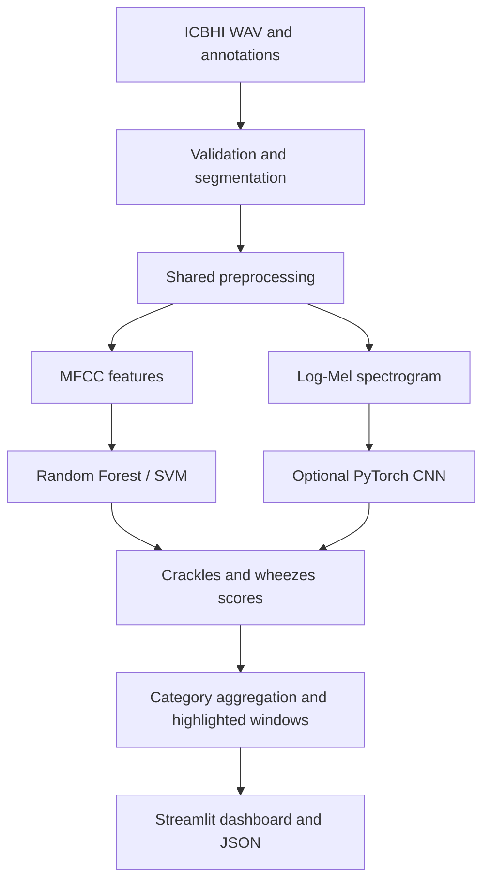

# Architecture

```mermaid
flowchart TD
 A[ICBHI WAV and annotations] --> B[Validation and segmentation]
 B --> C[Shared preprocessing]
 C --> D[MFCC features]
 C --> E[Log-Mel spectrogram]
 D --> F[Random Forest / SVM]
 E --> G[Optional PyTorch CNN]
 F --> H[Crackles and wheezes scores]
 G --> H
 H --> I[Category aggregation and highlighted windows]
 I --> J[Streamlit dashboard and JSON]
```
Training is separate from app startup. Dataset annotations and model predictions are different concepts.
